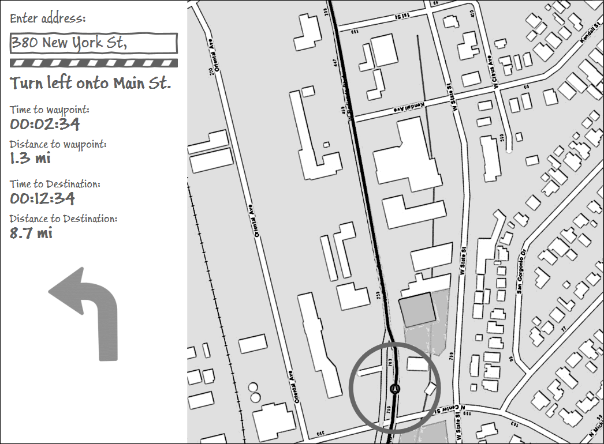

Routing Sample - ArcGIS Runtime for .NET
=======================

Sample app that shows how to write a turn-by-turn routing application using the [ArcGIS Runtime SDK for Windows Store, Windows Phone and Windows Desktop (WPF) apps](https://developers.arcgis.com/net/). The app uses MVVM and shares the services, models and viewmodels between all platforms, but uses individual views tailored for the experience on the specific device.

